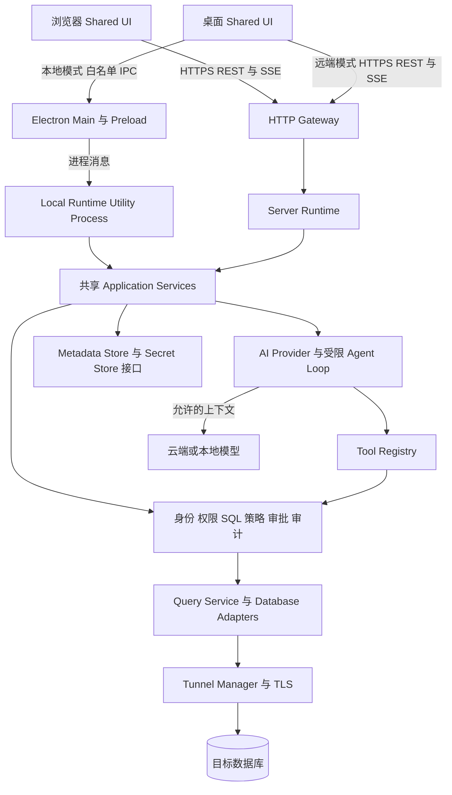
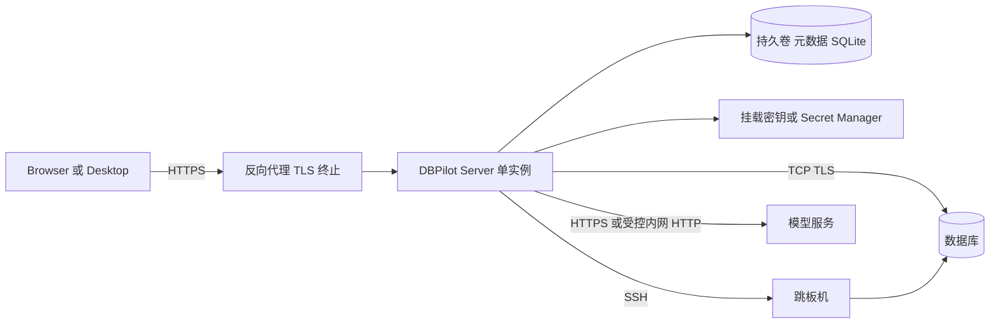
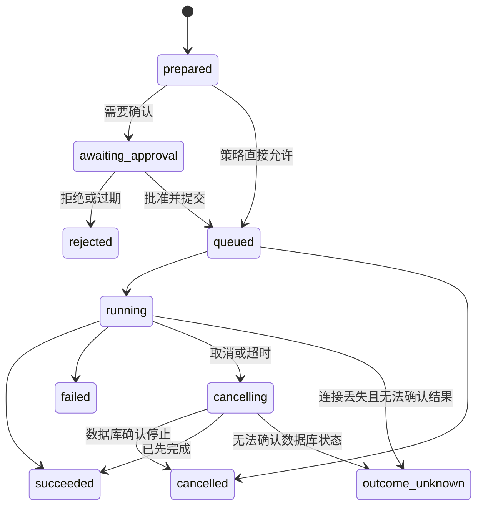
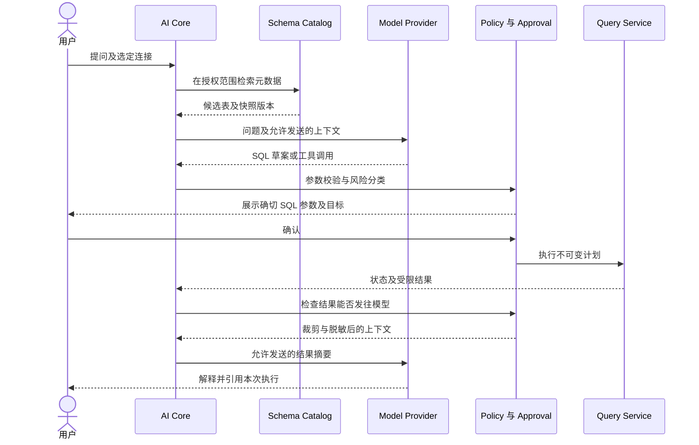

# DBPilot AI 数据库管理工具总体技术架构设计

版本：0.2　日期：2026-09-18　状态：待审查

本文用于确认产品的总体技术路线、模块边界、运行模式和第一阶段交付范围。建议采用 **共享 Web UI + TypeScript 模块化核心 + Electron 桌面端 + Node.js 服务端**。核心业务逻辑共享，运行环境通过适配器注入；AI 通过受控工具调用使用数据库能力。第一阶段不拆微服务，不引入强制 Python 后端。AI 定位为对话式、工具驱动的数据库 Agent，支持建议与执行两种模式；查询、数据增删改和结构变更通过分级授权控制，不能未经授权自主修改数据库。

本稿以现有项目目录名 DBPilot 为工作名称，不代表已完成品牌定名。对话式工具 Agent、完整数据库操作能力和分级授权方向已确认；文中其余选型、容量指标和阶段划分仍为设计建议，需通过审查及技术验证后确立。

本次修订同步更新 AI 定位、执行能力矩阵、SQL 入口、交付与验收要求。页面布局与具体 UI 功能细节暂不展开。

## 1 设计依据与范围

### 1.1 已明确的需求

依据调研文档第 1、3、9、13 节及引用对话中的原始需求，系统必须支持本地或服务器部署、Web 与桌面双端、尽可能原生的 TS 或 Python AI 集成，以及远程数据库访问。

调研建议的“TypeScript 单核心、双 Runtime”作为本稿主线。桌面直接访问数据库、桌面连接远端 DBPilot Server，以及浏览器连接 DBPilot Server，均属于产品形态。远程访问在本版指数据库 TCP/TLS、SSH 隧道和 HTTPS 网关访问，不扩展为通用远程终端或服务器运维平台。

### 1.2 本版假设与边界

- 首批用户为开发者及小团队，服务器采用单实例自托管；不承诺公网多租户 SaaS 隔离或高可用。
- 第一阶段接入 PostgreSQL、MySQL 和 SQLite。其他数据库通过适配器扩展，不承诺 SQL 方言完全统一。
- 本地桌面无需账号及云端控制面；联网模型属于可选能力，关闭 AI 后数据库工具仍可用。
- AI 采用单 Agent + 受控工具，支持 Schema 检索、SQL 编写、解释、修正、优化，以及授权后的查询、INSERT/UPDATE/DELETE 和 CREATE/ALTER/DROP 等结构变更。只读是可选权限配置，不是系统能力上限。
- 用户可手写 SQL 直接执行，也可让 AI 修改已有 SQL，再选择人工执行或 Agent 执行。脚本、交互事务和数据库管理操作保留能力边界，按数据库支持情况逐项开放；具体覆盖清单在详细设计中确定。
- 不包含数据库备份引擎、跨库分布式事务、数据同步、完整变更审批平台、Notebook、通用插件市场。

### 1.3 相对调研的收敛

| 议题 | 调研中的建议或备选 | 本稿建议 |
|---|---|---|
| 前端 | React 或 Vue | React + TypeScript，待团队偏好确认 |
| HTTP 框架 | Hono 或 Fastify | Fastify，统一校验、认证和生命周期入口 |
| 桌面 Core | Main 或本地 Node Runtime | 独立 Utility Process；Main 保持轻量 |
| 元数据 | SQLite 或 PostgreSQL | 首版均用 SQLite，仅限单实例；保留存储接口 |
| AI 操作 | 查询及受控 DML/DDL 工具 | 对话式 Agent；按用户、环境、操作和影响范围分级授权 |
| RBAC 和审计 | 团队能力逐步加入 | 首版已有身份、资源归属、最小权限和基础审计 |
| MCP 与 Python | 可扩展能力 | 后续阶段；不进入首版内部关键链路 |

## 2 架构决策

### 2.1 三种路线比较

| 路线 | 主要收益 | 主要成本 | 结论 |
|---|---|---|---|
| Electron + TS Core + Node Server | UI、驱动、AI 编排复用，单语言业务核心 | Electron 包体及原生依赖打包成本 | 推荐 |
| Electron + Python 服务端 | 数据科学生态直接可用 | Python 分发、进程通信及双语言契约维护 | 分析功能成为主产品时再评估 |
| Tauri + Rust Core 或 TS Sidecar | 可围绕原生体积及系统集成优化 | Rust 技能及桥接成本，TS 核心仍需独立分发 | 暂不采用 |

选择 TS Core 不意味着所有代码运行在同一进程，也不意味着 Electron Main 与服务器入口共享实现。共享的是应用服务、策略、领域模型、驱动适配器与 AI 编排；认证、密钥管理、文件访问及进程生命周期由 Runtime 提供。

### 2.2 总体逻辑架构



图中的共享模块代表代码复用，Local 与 Server 各自实例化，互不共享内存、连接池或凭据。所有人工、AI、未来 MCP 执行入口都经过同一策略及查询服务，不能直接调用裸 Driver。

### 2.3 技术选型基线

| 层次 | 建议选型 | 使用边界 |
|---|---|---|
| 工程 | pnpm workspace + TypeScript | 首版不要求额外 Monorepo 调度框架 |
| UI | React、Vite、Monaco | 页面不依赖 Node、Electron 或数据库驱动 |
| 状态与结果表格 | TanStack Query、Zustand、TanStack Table/Virtual | 服务端缓存、界面状态与行虚拟化分开 |
| 桌面 | Electron、electron-builder | 本地静态 UI、最小 preload、签名与更新通道 |
| 服务端 | Node.js 受支持 LTS、Fastify | 单实例模块化应用 |
| 契约 | Zod 运行时校验 + JSON Schema/OpenAPI | HTTP 与 IPC 共用 DTO，不仅共享 TS 类型 |
| 数据库 | pg、mysql2、better-sqlite3 | 包装为独立 Adapter，禁止向 UI 泄露驱动对象 |
| SSH | ssh2 | 单跳本地转发；主机密钥验证 |
| AI | 原生 fetch 或供应商官方 SDK | Provider 隔离协议差异，不强依赖 Agent 框架 |
| 持久化 | SQLite + 版本化 SQL migration | 元数据访问在独立 Worker 中串行管理 |
| 验证 | Vitest、真实数据库集成测试、Playwright | 跨 Runtime 契约及桌面打包验证 |

这些是拟采用组件，不是已验证兼容性矩阵。立项时锁定版本、许可证及 Electron ABI；尤其验证 SQLite 原生模块、Monaco Worker、三平台产物和不同 AI 协议。避免以浮动 latest 作为发布依赖。

## 3 运行模式与信任边界

### 3.1 三条实际调用链

| 模式 | 调用链 | 数据库凭据和查询实际所在位置 |
|---|---|---|
| Desktop Local | Renderer → Preload → Main → Local Core → DB | 用户设备 |
| Web Server | Browser → HTTPS → Server Core → DB | 部署服务器 |
| Desktop Remote | 打包的 Renderer → HTTPS → Server Core → DB | 部署服务器；桌面只保存服务器登录信息 |

Desktop Remote 仍加载本地打包 UI，不能将任意远程网页加载为具有本地权限的界面。本地模式默认不监听 HTTP 端口，避免额外暴露 localhost 服务。浏览器如需访问部署机器上的数据库，应通过该机器运行的 Server，不能借浏览器绕过网关。

每个工作区绑定 `RuntimeTarget`。连接、查询、会话、缓存键均包含 `runtimeId + workspaceId`。切换 Runtime 时关闭旧订阅、清空敏感结果视图，并明确提示仍在运行的任务；不自动迁移连接、密钥或执行中的事务，不在远端不可用时静默回退本地。

### 3.2 桌面进程模型

Main 负责窗口、系统文件选择、密钥代理、启动和监督 Local Core；Utility Process 运行应用服务、异步驱动和 AI。同步 SQLite 目标查询放入可终止的独立 Worker，不能阻塞 Main 或 Core 事件循环。Utility Process 是故障隔离单元，不是运行不可信插件的安全沙箱。

Renderer 启用 `contextIsolation`、sandbox，关闭 `nodeIntegration`，配置 CSP。Preload 只暴露命名操作与受控事件订阅；Main 校验 IPC 来源和参数，不暴露任意频道、文件路径读写、shell 或模块加载。该边界依据 [Electron 安全建议](https://www.electronjs.org/docs/latest/tutorial/security)；独立进程机制参见 [Utility Process](https://www.electronjs.org/docs/latest/api/utility-process)。

Core 崩溃后由 Main 重启，旧查询标记 interrupted 或 outcome_unknown，旧事务句柄失效，UI 重新握手。自动恢复只覆盖连接和元数据读取，不重放 SQL。

### 3.3 服务端部署模型



首版提供 Docker Compose，UI 与 API 同源。数据库驱动看到的网络、localhost 和文件路径都属于 Server 所在环境；用户浏览器里的文件路径无意义。Server SQLite 目标只接受管理员注册的目录及文件，不提供任意路径访问；桌面 SQLite 文件由系统选择器授权。

服务端 SQLite 元数据放持久卷，运行单副本，不共享到多个容器或网络文件系统。未来多实例需要 PostgreSQL 元数据、共享结果存储、任务归属/路由和分布式事件机制，不能只增加 replicas。

## 4 模块职责与依赖规则

| 模块 | 负责 | 不负责 |
|---|---|---|
| UI Workspace | 连接树、编辑器、结果网格、AI 面板、确认交互 | 密钥解密、直接驱动调用 |
| Runtime Client | HTTP/IPC 传输、版本协商、流事件归一化 | 业务授权 |
| Application Services | 用例编排、执行身份、资源归属、任务生命周期 | 特定数据库协议实现 |
| Policy Service | 连接权限、SQL 风险、审批绑定、出站数据策略 | 相信模型的权限判断 |
| Connection Service | Profile 解析、连接池配额、Secret 获取、隧道引用 | 跨用户无条件共享连接 |
| Query Service | 执行任务、事务会话、取消、分页结果、配额 | 用 LIMIT 代替权限控制 |
| Schema Catalog | 元数据同步、搜索、失效、权限过滤 | 完整业务数据镜像 |
| Database Adapter | 方言能力、元数据、执行、计划、取消 | 身份与审批决策 |
| AI Core | Provider、消息转换、预算、工具编排 | 绕过 Query Service 执行 SQL |
| Storage 与 Secrets | 配置、审计、状态、密钥引用和密文 | 明文密码返回给 UI/模型 |

依赖方向为入口 → Application → Domain/Ports → Adapter。`protocol` 不依赖运行环境；`ai-core` 依赖工具接口，不导入 `pg` 等驱动；`db-core` 不导入 Electron。Main、Server 是组合根，负责注入具体实现。

## 5 契约与通信设计

### 5.1 Runtime API

定义一个逻辑 API，两套传输绑定。HTTP 使用 `/api/v1`，IPC 使用命名操作；请求和返回都进行 Zod 校验。下列为边界示意，完整字段在详细设计阶段冻结。

```ts
type RuntimeTarget =
  | { kind: 'local'; runtimeId: string }
  | { kind: 'remote'; runtimeId: string; baseUrl: string };

interface RuntimeClient {
  describeRuntime(): Promise<RuntimeInfo>;
  listConnections(workspaceId: string): Promise<ConnectionSummary[]>;
  prepareQuery(input: PrepareQueryInput): Promise<QueryPlan>;
  decideApproval(input: ApprovalDecisionInput): Promise<void>;
  executeQuery(input: ExecutePreparedInput): Promise<{ executionId: string }>;
  getExecution(executionId: string): Promise<ExecutionSnapshot>;
  watchExecution(executionId: string, afterSeq?: number): AsyncIterable<ExecutionEvent>;
  getResultPage(input: ResultPageInput): Promise<ResultPage>;
  cancelQuery(executionId: string): Promise<CancelReceipt>;
}
```

`ExecutionContext` 在可信入口由会话创建，包含 principal、workspace、runtime、requestId、权限和预算；请求体不能指定或覆盖 principal。`RuntimeInfo` 返回协议版本、实例标识、支持能力及限额；不兼容的客户端阻止执行并提示升级，不能猜测字段。

### 5.2 HTTP 与流式事件

| 接口 | 语义 |
|---|---|
| `GET /api/v1/runtime` | 版本、模式和能力协商 |
| `POST /api/v1/connections` | 创建 Profile；密钥写入专用 Secret 操作 |
| `POST /api/v1/connections/:id/test` | 在权限及网络策略内测试连接 |
| `GET /api/v1/connections/:id/schema` | 带权限过滤和版本的元数据 |
| `POST /api/v1/query-plans` | 校验、分类、创建不可变执行计划和审批要求 |
| `POST /api/v1/approvals/:id/decision` | 已认证用户确认或拒绝 |
| `POST /api/v1/executions` | 执行获准计划，返回 202 与 executionId |
| `GET /api/v1/executions/:id` | 获取当前状态及结果可用性 |
| `GET /api/v1/executions/:id/events` | SSE 状态事件 |
| `GET /api/v1/executions/:id/results/:setId` | 通过不透明 cursor 读取分页结果 |
| `POST /api/v1/executions/:id/cancel` | 请求取消；并不等价于数据库已停止 |
| `POST /api/v1/ai/runs` | 创建 AI Run；事件、快照、取消采用同样任务模式 |

采用 fetch 读取 SSE，可使用认证头并统一主动取消。事件含 `executionId/runId、seq、type、timestamp、payload`，例如 started、progress、approval_required、completed、failed。结果行走有上限的分页接口，不放入无限增长的事件日志。心跳建议 15 秒；反向代理关闭流缓冲，并配置合适空闲超时。

重连使用 `afterSeq`，允许重复投递，客户端按序号去重。首版事件缓存有界且仅在内存中；过期或进程重启返回 `EVENT_GAP`，客户端读取快照，不重新创建任务。断开 SSE 不等于取消，取消须显式请求。WebSocket 在出现终端或真正双向协作需求时再引入。

统一错误码包括 `UNAUTHORIZED、FORBIDDEN、VALIDATION_FAILED、UNSUPPORTED_CAPABILITY、APPROVAL_REQUIRED、TIMEOUT、CANCEL_PENDING、RESOURCE_LIMIT、OUTCOME_UNKNOWN`。返回 requestId 和脱敏说明，不输出密码、连接串或完整驱动堆栈。

## 6 数据库能力与执行生命周期

### 6.1 Adapter 接口

```ts
interface DatabaseAdapter {
  readonly engine: 'postgres' | 'mysql' | 'sqlite';
  capabilities(): DatabaseCapabilities;
  open(config: ResolvedConnectionConfig): Promise<DatabaseSession>;
  test(config: ResolvedConnectionConfig): Promise<TestResult>;
  inspect(session: DatabaseSession, scope: MetadataScope): Promise<SchemaSnapshot>;
  classify(sql: string): Promise<SqlClassification>;
  execute(session: DatabaseSession, request: DriverQuery): AsyncIterable<DriverEvent>;
  explain(session: DatabaseSession, request: ExplainRequest): Promise<ExplainResult>;
  cancel(handle: DriverExecutionHandle): Promise<CancelOutcome>;
  begin(session: DatabaseSession, options: TransactionOptions): Promise<void>;
  commit(session: DatabaseSession): Promise<void>;
  rollback(session: DatabaseSession): Promise<void>;
  close(session: DatabaseSession): Promise<void>;
}
```

`ResolvedConnectionConfig` 仅存在于可信 Core 内存，可含短期明文 Secret，不进入通用 DTO、日志或消息历史。接口是内部契约草案，具体类型及能力验证不等于已实现。

Capabilities 至少包括 schemas、transactions、readOnlyTransaction、streaming、cancelMode、explain、multipleResults、parameterStyle。不支持的能力显式返回不支持，不能伪造统一行为。SQL 方言由 Adapter 处理；标识符按方言转义，数据值参数化。首版执行单条语句，不启用 MySQL multipleStatements。

### 6.2 连接与事务

连接池按 `runtime/workspace/connectionId/credentialVersion/role` 隔离，绝不跨权限上下文复用未清理的 Session。建议默认单连接配置最多 5 个物理连接，单用户最多 2 个并发查询，并设 Runtime 总预算；超额排队有超时，禁止无限建池。

首版每条人工或 AI DML 在独立事务中执行并提交；事务边界由 Query Service 控制，不接受用户手写 BEGIN/COMMIT 多语句脚本。后续交互式事务通过显式 sessionId 将一个物理连接租给同一用户和编辑器，空闲超时回滚。PostgreSQL 事务必须在同一客户端连接中完成，参见 [node-postgres 事务文档](https://node-postgres.com/features/transactions)。

归还连接前清理事务、临时会话设置和游标；无法确认干净则销毁连接。DDL 和管理命令存在不可回滚差异，必须逐方言声明并验证支持能力，不能承诺统一回滚。DDL 执行计划明确标记事务行为和不可撤销风险；管理命令使用单独权限。

多步骤任务记录步骤依赖、审批、执行结果和已提交状态。结构变更后刷新 Schema，再准备后续 SQL；下一步失败时停止并报告部分完成，不声称整项任务已回滚。脚本执行需逐句分类及明确事务边界，交互事务需专属会话；未实现的能力显式返回不支持，不将脚本原样透传为权限绕过通道。

### 6.3 查询状态与失败语义



查询提交带 clientRequestId，服务端持久化唯一键及 executionId，防止普通网络重试重复创建任务。幂等只保证本系统对同一请求不重复派发，不保证目标数据库 exactly-once；在执行已生效但结果未记账时，只能报告 outcome_unknown。写入、提交事务或未知状态绝不自动重试。

取消使用 Driver 支持能力，必要时通过独立控制连接发送取消；无可靠取消能力时标为 best_effort，销毁相关会话。UI 必须区分“取消已请求”和“已停止”。进程中断后未完成任务恢复为 interrupted/outcome_unknown，不从中间步骤恢复 AI 写操作。

### 6.4 结果集与资源控制

结果采用列元数据 + 行数组，防止同名列覆盖。int8 和 decimal 以带类型信息的字符串保真，二进制使用受限预览/编码，timestamp 区分带时区与无时区，NULL 独立表达；不把所有数据库类型转换为 JS number 或 Date。

交互查询建议首版上限 10,000 行或 20 MiB，按先到者截断并返回 `truncated=true`；分页默认 200 行。读取使用驱动流/游标及背压，结果按 executionId 暂存在有界内存中，TTL 建议 10 分钟，超期返回 RESULT_EXPIRED。不能靠前端虚拟滚动解决后端内存问题。

应用停止读取不等于数据库停止计算，因此同时设置查询超时和数据库侧可用的超时。任意 SQL 不通过追加 LIMIT 或重复 OFFSET 查询实现分页；分页针对同一次执行的结果快照。大数据导出及落盘 Spool 为后续任务能力，需要配额、下载授权、清理和数据留存策略。

## 7 AI 编排与安全执行

### 7.1 Agent 定位与工作模式

采用对话式、工具驱动的单 Agent。用户通过自然语言交代任务，Agent 结合对话上下文和授权范围内的 Schema，完成理解需求、制定步骤、生成 SQL、风险检查、必要确认、调用工具和结果解释。信息不足时追问，执行失败时提出修正方案；变更后的 SQL 重新进入执行策略。

建议模式只解释、生成或修改 SQL，不调用执行工具；执行模式使用同一 Agent 调用受控数据库工具。用户可随时选择自行执行生成的 SQL。两种模式共用上下文和能力接口，模式切换不等于取得新权限，也不自动执行之前的草稿。

例如“给订单表增加备注字段，再查询最近一周没有备注的订单”，Agent 拆成 DDL 与查询步骤，展示确切 SQL、目标与影响；取得相应授权后逐步执行，结构变化后重新检索元数据并校验后续步骤。它不是仅输出 SQL 的聊天助手，也不依赖多 Agent 架构。

### 7.2 Provider 与工具边界

```ts
interface LLMProvider {
  capabilities(): { streaming: boolean; toolCalling: boolean };
  stream(request: ModelRequest, signal: AbortSignal): AsyncIterable<ModelEvent>;
}
```

Provider 负责供应商消息格式、工具调用格式、流协议及错误映射。首版实现一个明确版本的 OpenAI-compatible 适配器，使用契约样例验证兼容性；其他厂商及本地模型按实际能力增加适配，不假定兼容接口完全一致。缺少可靠工具调用时降级为 SQL 草稿生成，不能从自由文本自动执行命令。

工具集合包括 search_schema、describe_table、propose_sql、explain_query、run_readonly、run_mutation、run_ddl、get_execution_status 和 cancel_query。propose_sql 支持新建及修改用户已有 SQL；run_mutation 覆盖 INSERT/UPDATE/DELETE；run_ddl 按方言开放已验证的结构操作。管理操作未来使用独立工具与权限，不纳入通用任意执行工具。工具均校验输入并获得当前执行身份；连接列表只返回授权连接，不含 Secret。AI 不提供 shell、文件任意读写、原始 Driver 或任意 HTTP 工具。

### 7.3 Agent Loop



编排状态至少包含 collecting_context、model_streaming、tool_pending、awaiting_approval、executing、completed、cancelled、failed。建议每 Run 最多 8 轮模型交互、20 次工具调用、120 秒有效运行时间；等待人工审批不占模型调用超时，但审批 5 分钟过期。按 Provider 设置 token/费用预算及服务端并发配额，实际阈值通过验证调整。

工具调用 JSON 未完整接收及校验前不得执行。模型 SQL 报错后最多提供一次自动修正建议，任何 SQL 改变都创建新计划和新确认；禁止无限修复执行循环。取消 Run 会终止模型流并请求取消其正在执行的查询，不声称撤销已经完成的数据库操作。

### 7.4 Schema 上下文

Catalog 保存 database/schema/table/column/index/comment 和版本、抓取时间；按数据库层级懒加载，提供手动刷新及建议 5 分钟 TTL。先用表名、列名、注释关键词检索，再提取少量表详情；不把整库 Schema 填入模型。

权限过滤先于搜索结果返回，缓存按连接凭据和权限上下文隔离。首版不引入向量数据库。Schema 变化、连接配置变化或权限变化使相关计划失效；模型解释引用本次实际 executionId，不能把历史结果作为最新事实。

### 7.5 SQL 策略与审批

系统能力、主体权限和本次操作授权分开管理。用户手写 SQL、AI 生成 SQL 和后续界面编辑数据均经过同一 Query Service、策略、审批与审计链路。AI 工具可用集合由用户授权与连接能力共同决定，隐藏工具不能替代执行端校验。

| 操作 | 人工入口 | AI 执行模式 |
|---|---|---|
| Schema 读取 | 授权后允许 | 仅访问授权元数据，遵守出站策略 |
| 只读查询 | 执行按钮触发，受配额约束 | 按策略直接执行或逐次确认；默认保守确认 |
| INSERT/UPDATE/DELETE | write 权限并按风险确认 | 支持；write 权限、明确执行计划和确认 |
| CREATE/ALTER/DROP 等 DDL | ddl 权限及已验证方言能力，明确确认 | 支持；展示对象变更与事务限制，明确确认 |
| SQL 编写、解释、修正和优化 | 用户编辑或选中已有 SQL | 生成或修改草稿；建议模式不执行 |
| 脚本与交互事务 | 按实现能力开放 | 可编排，需逐步授权及明确事务边界 |
| 用户授权和实例管理 | 独立 admin action，按具体功能开放 | 不默认赋权；具备相应工具和授权才可调用 |
| EXPLAIN | 方言允许的无执行计划 | 经策略允许；ANALYZE 另按真实执行风险控制 |
| 无法解析或未支持的语句 | 拒绝并说明原因 | 拒绝执行，可提供人工检查用草稿 |

策略结合操作者、目标环境、数据库账号、语句类型及影响范围判断。开发库查询可显式配置为直接执行；生产写入展示确切 SQL、参数和目标，并尽可能预估影响行数；无条件 UPDATE/DELETE、DROP 等采用更严格的专门授权与确认。预估值会受并发数据变化影响，不作为执行保证。确认不能提升数据库权限，执行也不等于可撤销。

SQL 安全不等于检查 SELECT 前缀。需防范写入 CTE、多语句、SELECT INTO、文件导出、存储过程、有副作用函数及解析失败。方言解析器只承担分类，不作为最终隔离边界；未知语法拒绝；只读通道使用只读账号和可用的只读事务，写入及结构变更使用具有对应最小权限的连接身份，不自动提升为超级用户。无法满足某类操作的权限或安全前提时，该操作仅生成草稿，不执行；不得将写操作伪装成只读工具调用。

审批记录绑定用户、工作区、Runtime、连接及配置版本、SQL 精确文本与参数摘要、策略版本、Schema 版本、有效期和一次性使用状态。执行前重新检查权限及版本，原子消费审批；编辑 SQL、替换参数、切换连接或权限变更均使审批失效。审批不是永久数据库授权，不能绕过数据库账号自身权限。

### 7.6 数据出站与提示注入

数据库注释、行内容及工具输出均视为不可信数据；其中出现的指令不得改变策略或工具权限。AI 不负责自我授权，模型不能创建批准记录。

默认向远程模型发送用户问题及明确允许的 Schema，不发送凭据或原始结果行。结果总结需用户启用连接级出站策略；先进行行列白名单、敏感列屏蔽、行数与字节裁剪，再交给 Provider。模型厂商留存条件由部署方配置和评估，不能由本系统承诺“数据绝不留存”。本地模型也必须经过相同数据策略，只是数据目的地不同。

## 8 远程连接与凭据管理

Profile 分开描述数据库 endpoint、TLS、SSH 和 Secret 引用。SSH 默认单跳，Core 建立仅绑定 loopback 的临时转发端口，Driver 连接该端口；Tunnel Manager 以租约/引用计数管理生命周期，先停用连接池再释放隧道。隧道重连只恢复连接能力，不重放查询。

SSH 主机指纹首次由用户或管理员核验并固定，变化时阻断；不静默接受任意 host key。TLS 默认验证 CA 与服务器名，隧道连接仍保留数据库逻辑主机名用于身份验证；私有 CA 可显式配置，不能为方便隧道统一关闭验证。

| 位置 | 保存内容 | 策略 |
|---|---|---|
| 桌面元数据 SQLite | Profile、历史、密钥引用或受保护密文 | 文件权限仅当前用户 |
| 桌面 Secret Store | DB 密码、SSH 私钥口令、模型 key、远端令牌 | OS Keychain/safeStorage 能力适配 |
| 服务器元数据 SQLite | 配置、密钥密文、认证与审计记录 | 加密字段含 keyId、nonce 和认证标签 |
| 服务器主密钥 | 加密根密钥 | 容器外 Secret 挂载或 Secret Manager，禁止与数据库一起明文存放 |
| Browser/Renderer | 非敏感偏好、短期视图状态 | 不持久化 DB 密码或模型 key |

Secret Store 启动时检查保护能力；桌面缺少可接受的系统密钥保护时采用仅会话保存并明确提示，不静默降级成明文。密码设置表单可以短暂接触输入，但保存后不回显 Secret。密钥轮换保留 keyId，逐条重加密；日志、错误、审计及导出均默认去密。

服务器连接能力意味着可发起网络请求。管理员配置允许的 DB/SSH/模型地址、端口及内网段，普通成员只能使用获授连接；阻止云元数据地址及未授权 loopback。域名解析后校验目标 IP，连接和重定向时持续执行策略。企业内网是合法用途，不能用“全禁私网”代替可配置策略。

## 9 身份 权限 存储与审计

### 9.1 身份与权限

Local Runtime 使用当前设备用户的本地 principal，不通过 UI 传入的 owner 字段授权。Server 首版支持管理员引导创建本地账号及会话认证，Cookie 使用 HttpOnly、Secure、SameSite，写请求检查 CSRF/Origin；密码使用成熟密码散列实现，带登录限速、过期和撤销。Desktop Remote 登录取得短期访问令牌，刷新令牌通过桌面 Secret Store 保存，访问令牌不写入持久存储。OIDC 在后续团队阶段接入。

角色先定义 Admin、Editor、Viewer，但所有资源读取和写入仍检查 workspace membership、连接 grant 及具体 action。Viewer 可查看授权元数据和查询；Editor 也只有显式 connection.write grant 才能 DML，DDL 另需 connection.ddl grant；Admin 管理配置，不自动获得数据库超级用户身份。查询结果、事件流、审批、历史及取消接口必须执行相同资源归属检查。

首版不承诺对任意手写 SQL 提供完整列级脱敏和行级隔离。这类保证必须依赖数据库受限角色、视图或 RLS；AI 出站脱敏不能替代数据库权限。共享高权限数据库账号时，不能靠隐藏 UI 树节点提供真正隔离。

### 9.2 元数据模型

| 实体 | 关键字段与约束 |
|---|---|
| User / Workspace / Membership | 主体、工作区、角色；本地也保留等价逻辑模型 |
| ConnectionProfile / ConnectionGrant | workspaceId、engine、endpoint、secretRef、版本、允许 action |
| SecretRecord | 密文、keyId、保护方式；API 不支持明文读取 |
| SchemaSnapshot | connectionId、权限上下文、version、capturedAt |
| QueryPlan / Approval | 精确查询、参数摘要、策略版本、主体、过期时间、消费状态 |
| QueryExecution | requestId 唯一约束、planId、状态、时间、行数、错误分类 |
| AIRun / AIMessage | Provider、模型、预算、状态、裁剪后的消息、关联执行 |
| AuditEvent | principal、资源、action、结果、requestId、sequence、时间 |

所有带工作区的外键关系校验 workspace 一致性；不能仅凭不可猜测 ID 授权。首版结果行不长期持久化；SQL 草稿及聊天可含敏感信息，按工作区配置留存，默认建议历史 30 天、审计 90 天。留存数值属于产品决策，详见审查清单。

### 9.3 审计与一致性

记录连接变更、Secret 变更、授权变更、计划生成、审批、执行开始/结束、取消及模型数据出站。默认记录 SQL hash、归一化摘要和参数类型，不在普通日志保存原始参数、结果行或完整 Prompt。允许授权用户查看的原始 SQL 历史与运维日志分开存储。

执行前先持久化审计意图与任务状态，再发送数据库操作；首版审计存储不可写时拒绝新的数据库执行。完成事件写入失败时不能声称目标数据库已回滚，状态恢复为待核对或 outcome_unknown。目标数据库与元数据存储没有原子事务，需显式保留这项边界。

本地 SQLite 审计可被拥有机器权限的人修改，不称为防篡改审计。企业阶段可增加独立审计接收端及保留策略。

## 10 部署运维与非功能目标

### 10.1 生命周期

启动顺序：校验配置与密钥 → 加锁迁移元数据 → 初始化策略及 Adapter → 恢复任务状态 → 开放 readiness。连接池按需建立，不在启动时连接所有数据库。升级前备份元数据，迁移失败保持服务不可写；降级只允许兼容版本或恢复已验证备份。

退出顺序：拒绝新任务 → 停止 AI Run → 在有限宽限时间内等待查询 → 请求取消 → 回滚仍受控的事务 → 关闭池和隧道 → 刷新审计。目标不可达或最终提交状态无法确认时保留未知状态。桌面关闭窗口时对活动写入提示，不直接当作执行失败。

备份覆盖元数据及密钥恢复材料，但分别保管；使用 SQLite 在线备份机制或停服一致性备份，不只复制活动主文件。首版建议每天备份并进行恢复演练；DBPilot 不备份目标业务数据库。

### 10.2 可观测性与目标

| 项目 | 首版建议验收目标或限制 |
|---|---|
| API 开销 | 不含 DB/模型耗时，20 并发会话下 P95 小于 200 ms |
| 交互结果 | 10,000 行且单元格有界时虚拟滚动可用，无整体页面卡死 |
| 查询上限 | 默认 30 秒、10,000 行或 20 MiB；管理员可调低或授权调高 |
| 取消反馈 | 1 秒内返回取消请求受理；最终停止时间取决于数据库能力 |
| Runtime 结果预算 | 默认累计结果缓存 200 MiB，超限拒绝或淘汰过期结果 |
| 故障恢复 | Core 重启后可重新连接，历史任务不误显示成功、不自动重放 |
| 首版容量 | 单实例、20 活跃用户基准；发布前基于 4 vCPU/8 GiB 测试 |

这些是验证目标，不是已经测得的性能。模型首 token 延迟与 SQL 运行时间不纳入本系统 API 开销保证。指标包含连接池占用、排队时间、查询耗时、取消状态、结果字节数、AI token/预算、审批拒绝、审计写入失败；维度避免原始 SQL 和高基数用户数据。readiness 不要求所有外部数据库在线，liveness 不执行真实业务查询。

## 11 仓库结构与交付阶段

```text
apps/
  web/                 # React 入口及浏览器 Runtime 绑定
  desktop/             # Main preload Utility Process 启动与打包
  server/              # Fastify 路由 认证 配置和生命周期
packages/
  workbench/           # 双端共享页面与交互
  ui/                  # 基础组件
  protocol/            # DTO Zod schemas 错误及事件
  runtime-client/      # IPC/HTTP 适配
  application/         # 连接 查询 AI 等用例入口
  db-core/             # Session QueryResult Capabilities
  db-postgres/         # PostgreSQL Adapter
  db-mysql/            # MySQL Adapter
  db-sqlite/           # SQLite Adapter 与 Worker
  ai-core/             # Provider Agent Loop Tool Registry
  security/            # Policy SQL 分类 审批与出站规则
  connectivity/        # SSH TLS 地址校验
  storage/             # Repository migrations 元数据 Worker
  secrets/             # Secret Store ports 与运行时实现
  observability/       # 脱敏日志 指标 审计接口
tests/
  contract/            # 两种 Runtime 和 Adapter 一致性
  integration/         # 真实数据库 SSH 故障场景
  e2e/                 # 浏览器及桌面关键流程
docs/
  adr/                 # 审查通过后的决策记录
```

包是代码边界，不对应微服务。MCP 和 Python 在实际启动相应阶段时才增加包，避免先建立无实现的抽象层。

| 阶段 | 交付范围 | 退出条件 |
|---|---|---|
| A 技术验证 | 双 Runtime 最小查询、三驱动、SQLite Worker、IPC/SSE、打包 | 同一查询契约在本地和远端通过；可取消/可报告限制；三平台可启动 |
| B 数据库基础闭环 | 连接、Schema、手写 SQL、结果、受控 DML/已验证 DDL、认证授权、TLS/SSH、Secret 和审计 | 实际 DB 端到端通过，写入与结构变更符合权限，故障无绕过 |
| C AI MVP | 对话式 Agent、建议/执行模式、SQL 生成与修改、分级授权的查询/DML/已验证 DDL、出站控制、预算 | 合法授权操作可执行；未经授权不可执行；中断不重复写入，部分完成如实报告 |
| D 团队与扩展 | OIDC、更多驱动、MCP、审批增强、PostgreSQL 元数据 | 根据真实用户需求单独审查范围 |
| E 分析能力 | 大结果导出、Arrow/Parquet、Python Worker、Notebook | 按分析场景另立设计，不影响基础客户端链路 |

阶段 A 到 C 构成首版，DML 与已验证的 DDL 纳入人工和 AI 两条执行链验收；具体语句覆盖、脚本和管理能力在详细设计中逐项确认，不承诺全部数据库操作一次交付。每阶段都演示 Web、Desktop Local、Desktop Remote，避免最后才补双端兼容。团队规模与投入未知，本稿不提供未经估算的工期承诺。

MCP 后续以边缘适配器复用 Application Services，使用 stdio 或 Streamable HTTP，不作为内部 RPC。远程入口独立认证、Origin 验证、能力协商及工具权限，审批继续走应用状态机；无交互客户端无法满足审批时返回 pending/拒绝，不能自动放行。协议参考 [MCP Transports 2025-11-25](https://modelcontextprotocol.io/specification/2025-11-25/basic/transports)，实现时固定兼容版本。

## 12 验证策略与主要风险

### 12.1 必须验证的场景

1. 三种运行模式执行同一连接、元数据、查询和错误样例；HTTP/IPC DTO 及序列化结果一致。
2. PostgreSQL/MySQL/SQLite 分别验证事务、取消或取消限制、超时、精度、时区、NULL、重复列名和截断。
3. 跨工作区读取连接、结果、事件、审批和取消均被拒绝；前端伪造 principal 无效。
4. 写入 CTE、多语句、带副作用函数、EXPLAIN ANALYZE、未知方言不能进入 AI 只读通道；数据库账号形成第二道限制。
5. 审批后改 SQL、改参数、改连接、撤销权限、重复消费审批均失败。合法授权的人工与 AI INSERT/UPDATE/DELETE、已支持 CREATE/ALTER/DROP 可成功；只读身份不可执行这些操作，点击确认也不能越权。
6. SSE 断线重连、缓存过期、重复 POST、模型超时、Core 崩溃、SSH 断开和提交时断网不产生静默重放。
7. Schema/结果中的提示注入不能新增权限；截断或非法 tool JSON 不执行；禁用结果出站后 Provider 捕获不到原始行。
8. 大结果、巨大单元格、连接洪泛、长查询和 SQLite 同步任务不会阻塞窗口或突破总配额。
9. 全新系统安装、升级迁移、密钥保护不可用、备份恢复及签名产物验证通过。
10. 建议模式不执行 SQL；手写 SQL、AI 修改 SQL 与 AI 直接生成 SQL 共用策略。多步骤任务部分成功后失败，应记录已提交变更并停止，不虚假承诺全量回滚。

单元测试聚焦策略和状态机；驱动能力通过真实数据库验证，不能仅用 mock 声称支持。设计稿不代表这些测试已经执行。

### 12.2 风险与应对

| 风险 | 影响 | 首版应对 |
|---|---|---|
| SQL 解析覆盖不完整 | 把危险 SQL 误当只读 | 未知拒绝、最小 DB 账号、限制工具集 |
| 多 Runtime 实现漂移 | 本地与服务器行为不同 | 同一 Application 和契约测试套件 |
| 原生模块与 Electron ABI | 桌面包启动失败 | 技术验证先打包并锁版本 |
| 目标提交与审计不原子 | 错误重试或错误状态 | 持久化意图、未知状态、禁止自动重放 |
| 模型上下文泄露 | Schema 或业务数据外发 | 连接级出站配置、默认无结果行、可禁用 AI |
| 服务端共享连接权限过大 | 用户可读取超出预期数据 | DB 最小角色；不虚构应用层完整行列隔离 |
| 范围扩张 | 无法完成基础工具 | 首版不做 MCP/Notebook/微服务/任意插件 |

## 13 请审查的关键决策

建议优先审查下表，再进入接口详细设计和实现计划。D05、D06 的能力方向已确认，具体语句及阶段覆盖仍待细化；其余未回复的条目保持“建议”，不视为已批准。

| 编号 | 待决定事项 | 本稿推荐 | 选择其他方向的影响 |
|---|---|---|---|
| D01 | 主技术路线 | Electron + TypeScript Core + Node Server | Python/Rust 为主将改变进程和打包设计 |
| D02 | 前端及 HTTP 框架 | React + Fastify | Vue/Hono 可行，需调整 UI 和入口实现 |
| D03 | 首版部署定位 | 个人与小团队，单实例自托管 | SaaS/多副本需提前设计租户与任务调度 |
| D04 | 首批数据库 | PostgreSQL、MySQL、SQLite | 更多驱动增加验证及方言成本 |
| D05 | AI 定位与执行权限 | 已确认：对话式工具 Agent；建议/执行模式；查询、DML、DDL 分级授权 | 具体授权粒度、方言覆盖和高风险规则待详细设计 |
| D06 | SQL 操作入口 | 已确认：手写 SQL、AI 生成/修改 SQL，均可进入统一执行链 | 脚本、交互事务及管理操作按能力逐项开放 |
| D07 | 外部模型数据边界 | 允许配置的 Schema，默认不发结果行 | 自动结果分析需要明确出站策略 |
| D08 | 首版元数据存储 | 单实例 SQLite，接口可替换 | 首发团队 HA 则建议直接 PostgreSQL |
| D09 | 留存及资源默认值 | 历史 30 天、审计 90 天、结果 10 分钟 | 需按数据敏感性及部署资源调整 |
| D10 | 桌面发布平台与团队规模 | 三平台技术验证，实际发布顺序待定 | 影响 CI、签名预算及工期估算 |

## 14 依据与参考

- [AI 数据库管理工具技术调研与架构建议](./AI数据库管理工具技术调研与架构建议.md)，重点使用第 1、3 至 13 节；原调研日期为 2026-09-17。
- [调研 AI 数据库工具](chatgpt-conversation://6aabbd99-cb7c-83e9-9de6-e7cd11caec81)，采用其中的用户目标与共享 UI、TS Core、双 Runtime 方案；命名建议不作为已确认需求。
- [Electron Security](https://www.electronjs.org/docs/latest/tutorial/security)，用于桌面安全边界。
- [Electron Utility Process](https://www.electronjs.org/docs/latest/api/utility-process)，用于独立本地 Core 进程机制。
- [node-postgres Transactions](https://node-postgres.com/features/transactions)，用于事务连接约束。
- [MCP Transports](https://modelcontextprotocol.io/specification/2025-11-25/basic/transports)，用于后续外部 Agent 接入边界。

本版进一步定义的模块、接口、默认配额、执行语义与阶段安排属于架构建议；除已明确确认的 Agent 定位及操作能力方向外，引用来源不意味着其余新增决策已经获得用户认可。
