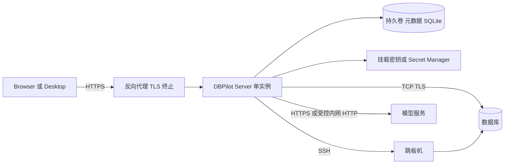
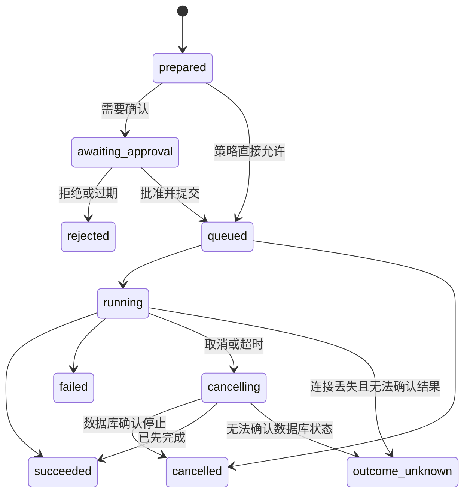
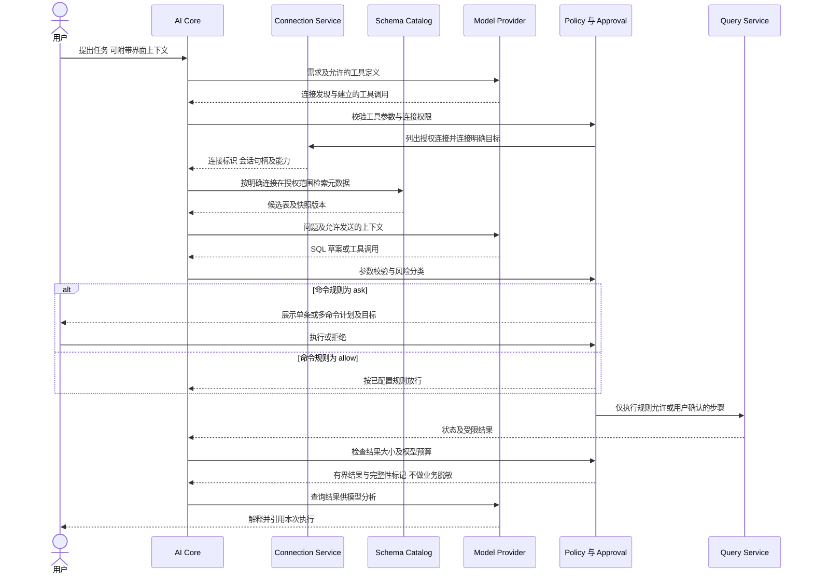

# DBPilot AI 数据库管理工具总体技术架构设计

版本：0.5　日期：2026-10-06　状态：产品范围已确认，技术细节持续完善

本文用于确认产品的总体技术路线、模块边界、运行模式和第一阶段交付范围。建议采用 **共享 Web UI + TypeScript 模块化核心 + Electron 桌面端 + Node.js 服务端**。核心业务逻辑共享，运行环境通过适配器注入；AI 通过受控工具调用使用数据库能力。第一阶段不拆微服务，不引入强制 Python 后端。AI 定位为对话式、工具驱动的数据库 Agent，支持建议与执行两种模式；查询、数据增删改和结构变更通过分级授权控制，不能未经授权自主修改数据库。

本稿以现有项目目录名 DBPilot 为工作名称，不代表已完成品牌定名。工作区级对话式工具 Agent、连接发现与建立、跨连接任务编排、完整数据库操作能力、分级授权方向及 shadcn/ui 组件选型已确认；文中其余选型、容量指标和阶段划分仍为设计建议，需通过审查及技术验证后确立。

本次修订落实个人无账号部署、macOS/Windows、三种首发数据库、DeepSeek 可配置模型、命令策略、结果直接交给模型、AI 新建连接和多命令统一确认。页面布局与具体 UI 功能细节暂不展开。

## 1 设计依据与范围

### 1.1 已明确的需求

依据调研文档第 1、3、9、13 节及引用对话中的原始需求，系统必须支持本地或服务器部署、Web 与桌面双端、尽可能原生的 TS 或 Python AI 集成，以及远程数据库访问。

调研建议的“TypeScript 单核心、双 Runtime”作为本稿主线。桌面直接访问数据库、桌面连接远端 DBPilot Server，以及浏览器连接 DBPilot Server，均属于产品形态。远程访问在本版指数据库 TCP/TLS、SSH 隧道和 HTTPS 网关访问，不扩展为通用远程终端或服务器运维平台。

### 1.2 本版假设与边界

- 首版完全用于个人单用户使用。本地工具及服务器自托管均无注册、登录、多用户、角色或团队共享功能；服务器操作其网络可达的数据库。采用单实例部署。
- 首发 MySQL、SQLite、PostgreSQL；MongoDB 等后续按需扩展。桌面优先 macOS 和 Windows；Web 可部署到服务器，Linux 桌面不属于首发验收。
- 首版 AI 适配 DeepSeek，模型地址、模型标识及 API Key 可配置；后续扩展 MiniMax、豆包、千问。关闭 AI 后数据库工具仍可用。查询结果允许直接交给模型分析，首版不做业务结果脱敏。
- AI 采用单 Agent + 受控工具，支持 Schema 检索、SQL 编写、解释、修正、优化，以及授权后的查询、INSERT/UPDATE/DELETE 和 CREATE/ALTER/DROP 等结构变更。只读是可选权限配置，不是系统能力上限。
- 用户可手写 SQL 或让 AI 生成/修改 SQL。首版支持多条命令组成执行计划：命令策略决定自动执行、等待确认或禁止；需确认的命令组展示后由用户执行或拒绝。SQL 默认先展示再执行，可通过用户配置的规则放行特定范围。
- AI 可使用已有连接，也可通过预封装工具新建或修改配置。敏感配置及命令由用户确认触发，凭据经专用输入交给 Secret Store。
- 不包含数据库备份引擎、跨库分布式事务、数据同步、完整变更审批平台、Notebook、通用插件市场。

### 1.3 相对调研的收敛

| 议题 | 调研中的建议或备选 | 本稿建议 |
|---|---|---|
| 前端 | React 或 Vue | 采用 shadcn/ui 官方 React 路线，使用 React + TypeScript |
| HTTP 框架 | Hono 或 Fastify | Fastify，统一校验、命令策略和生命周期入口 |
| 桌面 Core | Main 或本地 Node Runtime | 独立 Utility Process；Main 保持轻量 |
| 元数据 | SQLite 或 PostgreSQL | 首版均用 SQLite，仅限单实例；保留存储接口 |
| AI 操作 | 查询及受控 DML/DDL 工具 | 对话式 Agent；按用户、环境、操作和影响范围分级授权 |
| 账号与操作记录 | 调研包含团队 RBAC 参考 | 个人单用户，无账号/RBAC；保留命令规则、用户确认和执行记录 |
| MCP 与 Python | 可扩展能力 | 后续阶段；不进入首版内部关键链路 |

## 2 架构决策

### 2.1 三种路线比较

| 路线 | 主要收益 | 主要成本 | 结论 |
|---|---|---|---|
| Electron + TS Core + Node Server | UI、驱动、AI 编排复用，单语言业务核心 | Electron 包体及原生依赖打包成本 | 推荐 |
| Electron + Python 服务端 | 数据科学生态直接可用 | Python 分发、进程通信及双语言契约维护 | 分析功能成为主产品时再评估 |
| Tauri + Rust Core 或 TS Sidecar | 可围绕原生体积及系统集成优化 | Rust 技能及桥接成本，TS 核心仍需独立分发 | 暂不采用 |

选择 TS Core 不意味着所有代码运行在同一进程，也不意味着 Electron Main 与服务器入口共享实现。共享的是应用服务、策略、领域模型、驱动适配器与 AI 编排；调用来源校验、密钥管理、文件访问及进程生命周期由 Runtime 提供。

### 2.2 总体逻辑架构


图中的共享模块代表代码复用，Local 与 Server 各自实例化，互不共享内存、连接池或凭据。所有人工、AI、未来 MCP 执行入口都经过同一策略及查询服务，不能直接调用裸 Driver。

### 2.3 技术选型基线

| 层次 | 建议选型 | 使用边界 |
|---|---|---|
| 工程 | pnpm workspace + TypeScript | 首版不要求额外 Monorepo 调度框架 |
| UI | React、TypeScript、Vite、shadcn/ui、Tailwind CSS | shadcn/ui 已确认；共享组件及主题，页面不依赖 Node 或驱动 |
| SQL 编辑器 | Monaco Editor | 独立编辑能力，与共享主题协调 |
| 状态与结果表格 | TanStack Query、Zustand、TanStack Table/Virtual | 服务端缓存、界面状态与行虚拟化分开 |
| 桌面 | Electron、electron-builder | 本地静态 UI、最小 preload、签名与更新通道 |
| 服务端 | Node.js 受支持 LTS、Fastify | 单实例模块化应用 |
| 契约 | Zod 运行时校验 + JSON Schema/OpenAPI | HTTP 与 IPC 共用 DTO，不仅共享 TS 类型 |
| 数据库 | pg、mysql2、better-sqlite3 | 包装为独立 Adapter，禁止向 UI 泄露驱动对象 |
| SSH | ssh2 | 单跳本地转发；主机密钥验证 |
| AI | DeepSeek Provider + 可配置模型，原生 fetch/SDK | 首发只验证 DeepSeek；预留 MiniMax、豆包、千问适配 |
| 持久化 | SQLite + 版本化 SQL migration | 元数据访问在独立 Worker 中串行管理 |
| 验证 | Vitest、真实数据库集成测试、Playwright | 跨 Runtime 契约及桌面打包验证 |

这些是拟采用组件，不是已验证兼容性矩阵。立项时锁定版本、许可证及 Electron ABI；尤其验证 SQLite 原生模块、Monaco Worker、macOS/Windows 产物和不同 AI 协议。避免以浮动 latest 作为发布依赖。

### 2.4 UI 组件体系

UI 层已确定使用 [shadcn/ui](https://ui.shadcn.com/)，按其官方 React 路线与 Vite、TypeScript、Tailwind CSS 集成。其组件代码可在项目内定制，见[官方介绍](https://ui.shadcn.com/docs)与[Vite 集成文档](https://ui.shadcn.com/docs/installation/vite)。

基础组件、共享主题及样式变量统一放在 `packages/ui`，由 Web 和 Electron Renderer 共用；连接导航、SQL 工作区和工作区级 AI 面板在 `packages/workbench` 中组合。组件按需引入，记录上游来源及版本，更新时审查本地定制差异。

shadcn/ui 用于按钮、表单、对话框、菜单、标签页及面板等通用界面。SQL 编辑继续使用 Monaco；结果网格使用 TanStack Table/Virtual 实现表格状态与虚拟化，并与 shadcn/ui 样式统一。不能把普通 Table 组件视为已经具备大结果集性能。主题、键盘操作与焦点管理在双端验收，具体页面布局和视觉细节后续设计。AI 面板中的界面状态不改变 Agent 的工作区级操作范围。

## 3 运行模式与信任边界

### 3.1 三条实际调用链

| 模式 | 调用链 | 数据库凭据和查询实际所在位置 |
|---|---|---|
| Desktop Local | Renderer → Preload → Main → Local Core → DB | 用户设备 |
| Web Server | Browser → HTTPS → Server Core → DB | 部署服务器 |
| Desktop Remote | 打包的 Renderer → HTTPS → Server Core → DB | 部署服务器；桌面保存服务器地址，不建立应用账号 |

Desktop Remote 仍加载本地打包 UI，不能将任意远程网页加载为具有本地权限的界面。本地模式默认不监听 HTTP 端口，避免额外暴露 localhost 服务。浏览器如需访问部署机器上的数据库，应通过该机器运行的 Server，不能借浏览器绕过网关。

每个工作区绑定 `RuntimeTarget`。连接、查询、会话、缓存键均包含 `runtimeId + workspaceId`。切换 Runtime 时关闭旧订阅、清空敏感结果视图，并明确提示仍在运行的任务；不自动迁移连接、密钥或执行中的事务，不在远端不可用时静默回退本地。

### 3.2 桌面进程模型

Main 负责窗口、系统文件选择、密钥代理、启动和监督 Local Core；Utility Process 运行应用服务、异步驱动和 AI。同步 SQLite 目标查询放入可终止的独立 Worker，不能阻塞 Main 或 Core 事件循环。Utility Process 是故障隔离单元，不是运行不可信插件的安全沙箱。

2026-10-07 实现验证补充：SQLite 目标查询的 Worker 采用独立子进程，避免 better-sqlite3 原生调用期间强制终止线程可能导致整个 Runtime 崩溃。Web 路径已验证取消、事务与万行 IPC；Electron 下的子进程及原生模块仍需实际验收。

Renderer 启用 `contextIsolation`、sandbox，关闭 `nodeIntegration`，配置 CSP。Preload 只暴露命名操作与受控事件订阅；Main 校验 IPC 来源和参数，不暴露任意频道、文件路径读写、shell 或模块加载。该边界依据 [Electron 安全建议](https://www.electronjs.org/docs/latest/tutorial/security)；独立进程机制参见 [Utility Process](https://www.electronjs.org/docs/latest/api/utility-process)。

Core 崩溃后由 Main 重启，旧查询标记 interrupted 或 outcome_unknown，旧事务句柄失效，UI 重新握手。自动恢复只覆盖连接和元数据读取，不重放 SQL。

### 3.3 服务端部署模型



首版提供 Docker Compose，UI 与 API 同源。数据库驱动看到的网络、localhost 和文件路径都属于 Server 所在环境；用户浏览器里的文件路径无意义。Server SQLite 目标只接受用户配置的目录及文件，不提供任意路径访问；桌面 SQLite 文件由系统选择器授权。

服务端 SQLite 元数据放持久卷，运行单副本，不共享到多个容器或网络文件系统。未来多实例需要 PostgreSQL 元数据、共享结果存储、任务归属/路由和分布式事件机制，不能只增加 replicas。

## 4 模块职责与依赖规则

| 模块 | 负责 | 不负责 |
|---|---|---|
| UI Workspace | 连接树、编辑器、结果网格、AI 面板、确认交互 | 密钥解密、直接驱动调用 |
| Runtime Client | HTTP/IPC 传输、版本协商、流事件归一化 | 业务授权 |
| Application Services | 用例编排、执行身份、资源归属、任务生命周期 | 特定数据库协议实现 |
| Policy Service | 命令规则、SQL 风险、组确认绑定、上下文预算 | 相信模型的权限判断 |
| Connection Service | Profile 新建/修改、连接池配额、Secret 获取、隧道引用 | 绕过配置确认或让任务误用其他连接 |
| Query Service | 执行任务、事务会话、取消、分页结果、配额 | 用 LIMIT 代替权限控制 |
| Schema Catalog | 元数据同步、搜索、失效、权限过滤 | 完整业务数据镜像 |
| Database Adapter | 方言能力、元数据、执行、计划、取消 | 身份与审批决策 |
| AI Core | Provider、消息转换、预算、连接发现及跨连接任务工具编排 | 绕过 Query Service 执行 SQL |
| Storage 与 Secrets | 配置、审计、状态、密钥引用和密文 | 明文密码返回给 UI/模型 |

依赖方向为入口 → Application → Domain/Ports → Adapter。`protocol` 不依赖运行环境；`ai-core` 依赖工具接口，不导入 `pg` 等驱动；`db-core` 不导入 Electron。Main、Server 是组合根，负责注入具体实现。

## 5 契约与通信设计

### 5.1 Runtime API

定义一个逻辑 API，两套传输绑定。HTTP 使用 `/api/v1`，IPC 使用命名操作；请求和返回都进行 Zod 校验。下列为边界示意，完整字段在详细设计阶段冻结。

```ts
type RuntimeTarget =
  | { kind: 'local'; runtimeId: string }
  | { kind: 'remote'; runtimeId: string; baseUrl: string };

interface RuntimeClient {
  describeRuntime(): Promise<RuntimeInfo>;
  listConnections(workspaceId: string): Promise<ConnectionSummary[]>;
  preparePlan(input: PreparePlanInput): Promise<CommandPlan>;
  decideApproval(input: ApprovalDecisionInput): Promise<void>;
  executePlan(input: ExecutePreparedInput): Promise<{ executionId: string }>;
  getExecution(executionId: string): Promise<ExecutionSnapshot>;
  watchExecution(executionId: string, afterSeq?: number): AsyncIterable<ExecutionEvent>;
  getResultPage(input: ResultPageInput): Promise<ResultPage>;
  cancelQuery(executionId: string): Promise<CancelReceipt>;
}
```

`ExecutionContext` 在可信入口由会话创建，包含固定的个人 owner 标识、workspace、runtime、requestId、命令策略版本和预算；owner 仅用于内部归属，不对应账号表或登录。请求体不能修改策略或伪造确认。`RuntimeInfo` 返回协议版本、实例标识、支持能力及限额；不兼容的客户端阻止执行并提示升级，不能猜测字段。

### 5.2 HTTP 与流式事件

| 接口 | 语义 |
|---|---|
| `GET /api/v1/runtime` | 版本、模式和能力协商 |
| `POST /api/v1/connections` | 创建 Profile；密钥写入专用 Secret 操作 |
| `POST /api/v1/connections/:id/test` | 在权限及网络策略内测试连接 |
| `GET /api/v1/connections/:id/schema` | 带权限过滤和版本的元数据 |
| `POST /api/v1/command-plans` | 校验单条或多命令、逐条分类、创建不可变计划和组确认要求 |
| `POST /api/v1/approvals/:id/decision` | 用户从受信客户端确认或拒绝 |
| `POST /api/v1/executions` | 执行获准计划，返回 202 与 executionId |
| `GET /api/v1/executions/:id` | 获取当前状态及结果可用性 |
| `GET /api/v1/executions/:id/events` | SSE 状态事件 |
| `GET /api/v1/executions/:id/results/:setId` | 通过不透明 cursor 读取分页结果 |
| `POST /api/v1/executions/:id/cancel` | 请求取消；并不等价于数据库已停止 |
| `POST /api/v1/ai/runs` | 创建 AI Run；事件、快照、取消采用同样任务模式 |

采用 fetch 读取 SSE，复用部署访问通道并统一主动取消。事件含 `executionId/runId、seq、type、timestamp、payload`，例如 started、progress、approval_required、completed、failed。结果行走有上限的分页接口，不放入无限增长的事件日志。心跳建议 15 秒；反向代理关闭流缓冲，并配置合适空闲超时。

重连使用 `afterSeq`，允许重复投递，客户端按序号去重。首版事件缓存有界且仅在内存中；过期或进程重启返回 `EVENT_GAP`，客户端读取快照，不重新创建任务。断开 SSE 不等于取消，取消须显式请求。WebSocket 在出现终端或真正双向协作需求时再引入。

统一错误码包括 `UNAUTHORIZED、FORBIDDEN、VALIDATION_FAILED、UNSUPPORTED_CAPABILITY、APPROVAL_REQUIRED、TIMEOUT、CANCEL_PENDING、RESOURCE_LIMIT、OUTCOME_UNKNOWN`。返回 requestId 和已移除配置凭据的错误说明，不输出密码、连接串或完整驱动堆栈。

## 6 数据库能力与执行生命周期

### 6.1 Adapter 接口

```ts
interface DatabaseAdapter {
  readonly engine: 'postgres' | 'mysql' | 'sqlite';
  capabilities(): DatabaseCapabilities;
  open(config: ResolvedConnectionConfig): Promise<DatabaseSession>;
  test(config: ResolvedConnectionConfig): Promise<TestResult>;
  inspect(session: DatabaseSession, scope: MetadataScope): Promise<SchemaSnapshot>;
  classify(sql: string): Promise<SqlClassification>;
  execute(session: DatabaseSession, request: DriverQuery): AsyncIterable<DriverEvent>;
  explain(session: DatabaseSession, request: ExplainRequest): Promise<ExplainResult>;
  cancel(handle: DriverExecutionHandle): Promise<CancelOutcome>;
  begin(session: DatabaseSession, options: TransactionOptions): Promise<void>;
  commit(session: DatabaseSession): Promise<void>;
  rollback(session: DatabaseSession): Promise<void>;
  close(session: DatabaseSession): Promise<void>;
}
```

`ResolvedConnectionConfig` 仅存在于可信 Core 内存，可含短期明文 Secret，不进入通用 DTO、日志或消息历史。接口是内部契约草案，具体类型及能力验证不等于已实现。

Capabilities 至少包括 schemas、transactions、readOnlyTransaction、streaming、cancelMode、explain、multipleResults、parameterStyle。不支持的能力显式返回不支持，不能伪造统一行为。SQL 方言由 Adapter 处理；标识符按方言转义，数据值参数化。首版支持多命令计划，按方言识别语句边界后逐条检查和派发；不通过开启 MySQL multipleStatements 原样透传整个脚本。分号可能出现在字符串、注释或过程体内，禁止用简单字符串切分代替解析。

### 6.2 多命令计划与事务执行

单条 SQL 是只有一个步骤的计划；多条 SQL 或预封装函数命令组成 CommandPlan。每步包含 stepId、toolName、runtimeId、connectionId/配置版本、精确 SQL 或结构化参数、依赖、规则判定及状态。计划支持人工手写和 AI 生成，确认界面按顺序显示全部待执行命令、目标和预计影响。

命令策略对每一步判定 allow、ask 或 deny。自动步骤在依赖满足后执行；遇到 ask 时暂停，将已明确的连续待执行步骤组成一组，由用户点击“执行”或“拒绝”。组内含 deny 或未支持命令时不得提交执行。用户可编辑计划后重新检查；不因一个命令获准而把整组未知命令视为获准。用户拒绝后停止该组及依赖它的后续步骤，已完成的步骤保持原状态。

确认一次后，按依赖顺序逐条执行已批准的具体步骤，无需每条重复确认。根据前一步结果才生成的命令不属于原确认范围，生成后重新判断是否需要确认；不能预先批准尚未确定的 SQL。每条结果保留来源和状态，默认失败即停，展示成功、失败、未执行及结果未知的步骤。禁止在中断后自动重放写入。

CommandPlan 与数据库事务是两个层次：一次确认多条命令不承诺全部成功或全部回滚。首版默认顺序执行、按数据库正常提交语义处理；同连接显式 BEGIN/COMMIT/ROLLBACK 事务块由执行器识别、固定一个物理连接，出错时尝试回滚并如实记录最终状态。只开放已验证的方言事务语法，不支持的语法在执行前说明。普通使用不要求用户选择事务机制；跨请求长期保持的手动事务 UI 暂不作为首发要求。

PostgreSQL 事务必须在同一客户端连接完成，参见 [node-postgres 事务文档](https://node-postgres.com/features/transactions)。MySQL DDL 等可能隐式提交，计划须标记，不承诺跨库原子事务。DDL 后刷新 Schema；后续步骤的预期版本变化可在同一计划中记录并重新校验，无法证明原批准仍适用则暂停，不能自动扩大确认范围。

连接池按 runtime/workspace/connectionId/credentialVersion 隔离，建议单连接最多 5 个物理连接、每 Runtime 默认 2 个并发查询，均可配置。计划中的事务租用专属会话；归还前清理事务、游标及会话设置，无法确认干净则销毁。自动重连只恢复连接能力，不重放 SQL。

### 6.3 查询状态与失败语义



查询提交带 clientRequestId，服务端持久化唯一键及 executionId，防止普通网络重试重复创建任务。幂等只保证本系统对同一请求不重复派发，不保证目标数据库 exactly-once；在执行已生效但结果未记账时，只能报告 outcome_unknown。写入、提交事务或未知状态绝不自动重试。

取消使用 Driver 支持能力，必要时通过独立控制连接发送取消；无可靠取消能力时标为 best_effort，销毁相关会话。UI 必须区分“取消已请求”和“已停止”。进程中断后未完成任务恢复为 interrupted/outcome_unknown，不从中间步骤恢复 AI 写操作。

### 6.4 结果集与资源控制

结果采用列元数据 + 行数组，防止同名列覆盖。int8 和 decimal 以带类型信息的字符串保真，二进制使用受限预览/编码，timestamp 区分带时区与无时区，NULL 独立表达；不把所有数据库类型转换为 JS number 或 Date。

交互查询建议首版上限 10,000 行或 20 MiB，按先到者截断并返回 `truncated=true`；分页默认 200 行。读取使用驱动流/游标及背压，结果按 executionId 暂存在有界内存中，TTL 建议 10 分钟，超期返回 RESULT_EXPIRED。不能靠前端虚拟滚动解决后端内存问题。

应用停止读取不等于数据库停止计算，因此同时设置查询超时和数据库侧可用的超时。任意 SQL 不通过追加 LIMIT 或重复 OFFSET 查询实现分页；分页针对同一次执行的结果快照。大数据导出及落盘 Spool 为后续任务能力，需要配额、下载授权、清理和数据留存策略。

## 7 AI 编排与安全执行

### 7.1 Agent 定位与工作模式

采用工作区级、对话式、工具驱动的单 Agent。用户通过自然语言交代任务，Agent 结合对话上下文和授权范围内的 Schema，完成理解需求、制定步骤、生成 SQL、风险检查、必要确认、调用工具和结果解释。信息不足时追问，执行失败时提出修正方案；变更后的 SQL 重新进入执行策略。

建议模式只解释、生成或修改 SQL，不调用执行工具；执行模式使用同一 Agent 调用受控数据库工具。用户可随时选择自行执行生成的 SQL。两种模式共用上下文和能力接口，模式切换不等于取得新权限，也不自动执行之前的草稿。

例如“给订单表增加备注字段，再查询最近一周没有备注的订单”，Agent 拆成 DDL 与查询步骤，展示确切 SQL、目标与影响；取得相应授权后逐步执行，结构变化后重新检索元数据并校验后续步骤。它不是仅输出 SQL 的聊天助手，也不依赖多 Agent 架构。

Agent 的操作范围由已封装工具、用户资源权限和执行策略决定，不绑定当前打开的表。左侧连接选择、中间打开的表和选中的 SQL 是可选上下文；用户可在未打开任何表时直接要求 Agent 查找并连接数据库。任务明确且能力、授权齐备时，Agent 自行发现连接、建立会话、检索表、组织执行和汇总，无需用户先手动导航。

例如“连接远端测试库，找到订单和客户相关的表，统计最近一个月各客户的订单金额”，Agent 先调用 list_connections，确认目标后调用 connect_database，再通过 search_schema/describe_table 找到表和关联，生成并执行 SQL，最后引用实际结果给出结论。多个连接同名或目标环境不明确时追问；缺少配置时由 AI 草拟新连接配置，经策略及用户确认后保存，凭据通过专用输入补充，不猜测生产/测试环境，也不要求将密码写入聊天。

单个任务可依次访问多个授权连接。每个步骤固定 runtimeId、workspaceId、connectionId、配置版本和执行身份，结果保留来源及 executionId；UI 切换表或连接不改变已创建步骤的目标。结果汇总遵守各源的数据出站规则，不自动把一个数据库的数据写入另一个数据库。跨库复制需要单独的读取、写入计划和授权，跨连接事务不承诺原子提交或统一回滚。

“本地/远端数据库”描述数据库的位置，不等同于 Local/Server Runtime。首版跨连接任务在同一个 Runtime 内编排，可连接该 Runtime 网络可达的本地和远端数据库。跨 Runtime 的单任务编排需后续显式配置受信路由和逐端认证；不能靠切换 UI Runtime 隐式获得另一端权限，也不能让 Server 直接访问用户设备文件。工具参数保留 runtimeId，以便扩展。

### 7.2 Provider 与工具边界

```ts
interface LLMProvider {
  capabilities(): { streaming: boolean; toolCalling: boolean };
  stream(request: ModelRequest, signal: AbortSignal): AsyncIterable<ModelEvent>;
}
```

Provider 负责供应商消息格式、工具调用、流协议和错误映射。首版实现 DeepSeek Provider，提供 provider、baseUrl、modelId、apiKeyRef、超时、上下文预算及模型参数配置。默认模型在实现时按 DeepSeek 当时最新可用且通过工具调用测试的型号确定，不在业务代码里写死“最新”，运行记录保存实际请求的模型标识。用户可修改模型；配置变更只影响新 Run，已开始的 Run 固定配置快照。

DeepSeek API 可通过兼容接口接入，依据 [DeepSeek 官方 API 文档](https://api-docs.deepseek.com/zh-cn/)；模型能力通过实际配置验证。后续 MiniMax、豆包、千问分别增加 Provider/能力配置，不假定只换 URL 就完全兼容。首版无需为它们实现集成。缺少可靠工具调用时降级为草稿模式，不从自由文本直接执行命令。

工具集合包括 list_connections、create_connection、update_connection、connect_database、get_connection_status、disconnect_database、search_schema、describe_table、propose_sql、explain_query、run_readonly、run_mutation、run_ddl、execute_plan、get_execution_status 和 cancel_query。propose_sql 支持新建及修改用户已有 SQL；run_mutation 覆盖 INSERT/UPDATE/DELETE；run_ddl 按方言开放已验证的结构操作。管理操作未来使用独立工具与权限，不纳入通用任意执行工具。工具均校验输入并获得当前执行身份；连接列表只返回授权连接，不含 Secret。AI 不提供 shell、文件任意读写、原始 Driver 或任意 HTTP 工具。

工具必须由开发者预先注册。Agent 仅选择工具及提交结构化参数，不能在运行时自行创建工具或获得任意命令执行能力。工具实现可以是 TypeScript 函数、预封装 CLI 命令或受控服务接口；命令适配器使用固定可执行文件、参数白名单、超时与输出大小限制，通过参数数组启动，不拼接模型生成的 shell 字符串。Secret 由可信 Core 按引用读取，不进入模型参数或命令日志。

| 工具 | 输入与输出边界 | 执行约束 |
|---|---|---|
| list_connections | 工作区、名称/环境/引擎过滤；返回授权连接摘要与标识 | 不返回 Secret，仅搜索已配置资源 |
| create_connection / update_connection | AI 草拟连接字段及 secretRef；返回配置计划 | 默认 ask；用户确认保存，凭据经专用输入，模型不获取密码 |
| connect_database | 明确连接标识及配置版本；返回会话句柄 | 按命令规则、网络配置及配额连接，复用已有配置 |
| get_connection_status | 连接或会话标识；返回健康状态与能力 | 仅查看授权资源 |
| disconnect_database | 当前任务持有的会话/租约标识 | 释放自身租约，不关闭其他任务的会话 |
| search_schema / describe_table | 显式连接及对象范围；返回结构与版本 | 不以 UI 当前表作为隐式目标 |
| propose_sql / explain_query | 目标、方言、SQL 或需求；返回草案/计划 | 草案不自动执行，计划查询仍检查权限 |
| run_readonly / run_mutation / run_ddl / execute_plan | 单条或多命令不可变计划及所需确认引用；返回 executionId | 统一 Query Service 执行，逐步骤判断 allow/ask/deny |
| get_execution_status / cancel_query | executionId；返回状态或取消受理结果 | 校验任务所有权；取消不撤销已提交变更 |

工具注册项至少包含 name、version、description、inputSchema、outputSchema、requiredActions、sideEffect、timeoutMs 和 handler。Tool Executor 注入可信 ExecutionContext，验证参数、目标及权限，记录 runId/stepId/toolCallId，输出结构化成功或错误结果。工具名仅表示用途，不能替代对实际 SQL 的风险检查。新建和修改连接由专用预封装工具完成，不由 connect_database 隐式创建。命令规则修改仅允许用户操作，Agent 不能自行把 ask 改为 allow。

### 7.3 Agent Loop



编排状态至少包含 discovering_connections、connecting、collecting_context、model_streaming、tool_pending、awaiting_approval、executing、completed、cancelled、failed。建议每 Run 最多 8 轮模型交互、20 次工具调用、120 秒有效运行时间；等待人工审批不占模型调用超时，但审批 5 分钟过期。按 Provider 设置 token/费用预算及服务端并发配额，实际阈值通过验证调整。

每个连接步骤均经同一 Tool Executor，失败时只重试可安全重试的连接/读取动作；连接成功不代表后续写入已获授权。多连接任务逐步骤记录完成、失败和未执行状态，连接租约在结束、取消或超时后回收。

工具调用 JSON 未完整接收及校验前不得执行。模型 SQL 报错后最多提供一次自动修正建议，任何 SQL 改变都创建新计划并重新判定命令规则，ask 步骤重新确认；禁止无限修复执行循环。取消 Run 会终止模型流并请求取消其正在执行的查询，不声称撤销已经完成的数据库操作。

### 7.4 Schema 上下文

Catalog 保存 database/schema/table/column/index/comment 和版本、抓取时间；按数据库层级懒加载，提供手动刷新及建议 5 分钟 TTL。先用表名、列名、注释关键词检索，再提取少量表详情；不把整库 Schema 填入模型。

权限过滤先于搜索结果返回，缓存按连接凭据和权限上下文隔离。首版不引入向量数据库。外部或未预期的 Schema 变化、连接配置变化或权限变化使相关计划失效；计划内预期的 DDL 变化更新 Schema 快照并重新校验后续步骤，若实际目标或命令需改变则重新求值及确认；模型解释引用本次实际 executionId，不能把历史结果作为最新事实。

### 7.5 命令策略与用户确认

采用类似 Codex 的命令控制方式。用户配置哪些预封装工具或 SQL 操作可自动执行、哪些必须点击确认、哪些禁止。规则由用户管理，Agent 无权修改；同一规则匹配结合工具名、连接、SQL 操作类型、对象范围和参数约束，不只按命令名称或 SQL 前缀判断。

规则结果为 allow、ask、deny。建议 deny 优先，其次显式 ask，再匹配满足所有约束的 allow；没有匹配时默认 ask，未知语法或未注册能力返回不支持。SQL 解析识别写入 CTE、文件操作、有副作用函数等，不能把它们当普通 SELECT。所有规则均不能突破目标数据库账号自身权限。

| 操作 | 首版默认规则 | 用户行为 |
|---|---|---|
| 连接列表、已有连接状态、授权 Schema 元数据 | allow | 自动执行，记录过程 |
| 连接已保存的数据库、释放自身会话 | allow | 不改变目标或配置；受配额与网络设置约束 |
| AI 生成/解释/修改 SQL | allow | 只产生草稿，不执行 SQL |
| AI 发起的 SQL，包括 SELECT、DML、DDL、EXPLAIN | ask | 展示确切 SQL 和目标，用户执行或拒绝；可配置明确范围的自动规则 |
| 新建/修改连接配置、Secret 或其他敏感命令 | ask | AI 草拟，用户确认触发保存或执行；Secret 由用户专用输入 |
| 多命令计划 | 逐条求值后按组确认 | allow 步骤自动执行；ask 组一次确认；deny 不可通过组批准绕过 |
| 未封装命令、任意 shell、策略自我修改 | deny | 不执行 |

人工编辑器中点击“执行”即对所展示 SQL/命令组的明确操作请求，不再机械追加同样的确认；仍执行规则、能力和数据库权限检查，deny 不能靠人工入口绕过。AI 的 ask 命令必须获得界面实际点击，不能从模型文本推断用户已批准。

审批记录绑定 Runtime、工作区、计划版本、步骤顺序、工具与配置版本、SQL 精确文本和参数摘要、目标连接、有效期和一次性消费状态。一次确认只覆盖展示过的命令。新增、修改、重排命令或切换目标导致计划失效，重新判定并按需确认。执行前再次校验策略，原子领取步骤，避免确认请求重复造成重复写入。

敏感命令由用户控制执行，不因为 Agent 已经连上数据库就自动放行。执行结果以真实状态为准；拒绝或取消不会撤销已经提交的操作，多命令失败处理见第 6.2 节。

### 7.6 查询结果与模型上下文

查询结果可以直接交给已配置的模型分析并生成结论，首版不加入业务数据脱敏、敏感列屏蔽或逐次出站确认。保留行数、字节和 token 预算以控制内存与上下文；截断、采样或未返回全部行时标记完整性，模型不得把部分数据描述成完整统计。需全量汇总时优先提出聚合 SQL，执行仍遵守命令规则。

数据库密码、SSH 私钥、模型 API Key 等连接配置凭据始终留在 Secret Store，不放入 Prompt 或普通日志；这与用户查询到的业务数据不脱敏是两个不同范围。数据库注释、行内容及工具输出是数据，不能作为指令修改权限或伪造用户确认。

## 8 远程连接与凭据管理

Profile 分开描述数据库 endpoint、TLS、SSH 和 Secret 引用。SSH 默认单跳，Core 建立仅绑定 loopback 的临时转发端口，Driver 连接该端口；Tunnel Manager 以租约/引用计数管理生命周期，先停用连接池再释放隧道。隧道重连只恢复连接能力，不重放查询。

SSH 主机指纹首次由用户核验并固定，变化时阻断；不静默接受任意 host key。TLS 默认验证 CA 与服务器名，隧道连接仍保留数据库逻辑主机名用于身份验证；私有 CA 可显式配置，不能为方便隧道统一关闭验证。

| 位置 | 保存内容 | 策略 |
|---|---|---|
| 桌面元数据 SQLite | Profile、历史、密钥引用或受保护密文 | 文件权限仅当前用户 |
| 桌面 Secret Store | DB 密码、SSH 私钥口令、模型 key | OS Keychain/safeStorage 能力适配 |
| 服务器元数据 SQLite | 配置、密钥密文、命令策略与执行记录 | 加密字段含 keyId、nonce 和认证标签 |
| 服务器主密钥 | 加密根密钥 | 容器外 Secret 挂载或 Secret Manager，禁止与数据库一起明文存放 |
| Browser/Renderer | 非敏感偏好、短期视图状态 | 不持久化 DB 密码或模型 key |

Secret Store 启动时检查保护能力；桌面缺少可接受的系统密钥保护时采用仅会话保存并明确提示，不静默降级成明文。密码设置表单可以短暂接触输入，但保存后不回显 Secret。密钥轮换保留 keyId，逐条重加密；日志和错误不记录配置凭据；用户主动查询或导出的业务数据按原值处理。

服务器连接能力意味着可发起网络请求。个人用户配置允许的 DB/SSH/模型地址、端口及内网段，AI 新建配置仍经过同一检查；允许显式配置的 localhost 数据库，阻止未批准的网络目标及云元数据地址。域名解析后校验目标 IP，连接和重定向时持续执行策略。企业内网是合法用途，不能用“全禁私网”代替可配置策略。

## 9 单用户控制 存储与执行记录

### 9.1 无账号的个人运行模式

Local 与 Server 都只有一个逻辑 owner，不实现注册、登录、用户表、角色表、成员管理、RBAC 或 OIDC。Workspace 仅用于组织个人连接和历史，不表示团队租户。Server 是个人部署的数据库执行端，Desktop Remote 保存其地址并调用相同接口，不要求 DBPilot 账号或登录令牌。

命令 allow/ask/deny 与数据库账号权限仍然存在：它们决定 Agent 可以执行什么，与多人权限系统无关。用户可编辑命令规则、允许的连接目标和模型配置；模型不能修改这些控制设置或伪造点击确认。确认接口仅接收受信 UI 调用，禁止暴露为 Agent 工具。

无账号 Server 不提供公网身份隔离，默认绑定 loopback；远程使用通过个人受控网络或隧道访问。若部署为外网入口，访问保护由部署层承担，不在应用内增加账号系统。保留同源/Origin 校验、跨站请求防护以及桌面 IPC 来源校验；这些机制不等价于远程身份认证。

### 9.2 元数据模型

| 实体 | 关键字段与约束 |
|---|---|
| Workspace / RuntimeSettings | 个人工作区、固定 owner 标记、运行设置；无用户或成员表 |
| ConnectionProfile / CommandPolicy | 连接信息、secretRef、配置版本；allow/ask/deny 规则及约束 |
| SecretRecord | 密文、keyId、保护方式；API 不支持明文读取 |
| SchemaSnapshot | connectionId、权限上下文、version、capturedAt |
| CommandPlan / CommandStep / Approval | SQL/工具及参数、步骤顺序、依赖、目标、规则版本、组确认与消费状态 |
| QueryExecution | requestId 唯一约束、planId、状态、时间、行数、错误分类 |
| ModelProfile / AIRun / AIMessage | DeepSeek 配置与 key 引用、模型快照、预算、消息及关联执行 |
| AuditEvent | owner、发起来源（人工/AI）、资源、action、结果、requestId、sequence、时间 |

所有工作区、Runtime、连接和计划外键校验归属一致性，避免不同标签页或任务混用目标；工作区不是租户。首版结果行不长期持久化；SQL 草稿及聊天可含敏感信息，按工作区配置留存，默认建议历史 30 天、审计 90 天。留存值为可调整的工程默认值，不要求用户现在逐项确认。

### 9.3 审计与一致性

记录连接变更、Secret 变更、授权变更、计划生成、审批、执行开始/结束、取消及模型数据出站。默认记录 SQL hash、归一化摘要和参数类型，不在普通日志保存原始参数、结果行或完整 Prompt。供个人用户查看的原始 SQL 历史与运维日志分开存储。

执行前先持久化审计意图与任务状态，再发送数据库操作；首版审计存储不可写时拒绝新的数据库执行。完成事件写入失败时不能声称目标数据库已回滚，状态恢复为待核对或 outcome_unknown。目标数据库与元数据存储没有原子事务，需显式保留这项边界。

本地 SQLite 审计可被拥有机器权限的人修改，不称为防篡改审计。未来如新增企业需求，再单独设计防篡改审计。

## 10 部署运维与非功能目标

### 10.1 生命周期

启动顺序：校验配置与密钥 → 加锁迁移元数据 → 初始化策略及 Adapter → 恢复任务状态 → 开放 readiness。连接池按需建立，不在启动时连接所有数据库。升级前备份元数据，迁移失败保持服务不可写；降级只允许兼容版本或恢复已验证备份。

退出顺序：拒绝新任务 → 停止 AI Run → 在有限宽限时间内等待查询 → 请求取消 → 回滚仍受控的事务 → 关闭池和隧道 → 刷新审计。目标不可达或最终提交状态无法确认时保留未知状态。桌面关闭窗口时对活动写入提示，不直接当作执行失败。

备份覆盖元数据及密钥恢复材料，但分别保管；使用 SQLite 在线备份机制或停服一致性备份，不只复制活动主文件。首版建议每天备份并进行恢复演练；DBPilot 不备份目标业务数据库。

### 10.2 可观测性与目标

| 项目 | 首版建议验收目标或限制 |
|---|---|
| API 开销 | 不含 DB/模型耗时，个人使用下 2 个并发查询时 P95 小于 200 ms |
| 交互结果 | 10,000 行且单元格有界时虚拟滚动可用，无整体页面卡死 |
| 查询上限 | 默认 30 秒、10,000 行或 20 MiB；用户可配置 |
| 取消反馈 | 1 秒内返回取消请求受理；最终停止时间取决于数据库能力 |
| Runtime 结果预算 | 默认累计结果缓存 200 MiB，超限拒绝或淘汰过期结果 |
| 故障恢复 | Core 重启后可重新连接，历史任务不误显示成功、不自动重放 |
| 首版容量 | 个人单用户、多标签页；发布前记录实测硬件及资源占用 |

这些是验证目标，不是已经测得的性能。模型首 token 延迟与 SQL 运行时间不纳入本系统 API 开销保证。指标包含连接池占用、排队时间、查询耗时、取消状态、结果字节数、AI token/预算、审批拒绝、审计写入失败；维度避免原始 SQL 和高基数业务数据。readiness 不要求所有外部数据库在线，liveness 不执行真实业务查询。

## 11 仓库结构与交付阶段

```text
apps/
  web/                 # React 入口及浏览器 Runtime 绑定
  desktop/             # Main preload Utility Process 启动与打包
  server/              # Fastify 路由 来源校验 配置和生命周期
packages/
  workbench/           # 双端共享页面与交互
  ui/                  # shadcn/ui 基础组件 共享主题与样式
  protocol/            # DTO Zod schemas 错误及事件
  runtime-client/      # IPC/HTTP 适配
  application/         # 连接 查询 AI 等用例入口
  db-core/             # Session QueryResult Capabilities
  db-postgres/         # PostgreSQL Adapter
  db-mysql/            # MySQL Adapter
  db-sqlite/           # SQLite Adapter 与 Worker
  ai-core/             # Provider Agent Loop Tool Registry
  security/            # Policy SQL 分类 审批与出站规则
  connectivity/        # SSH TLS 地址校验
  storage/             # Repository migrations 元数据 Worker
  secrets/             # Secret Store ports 与运行时实现
  observability/       # 移除配置凭据的日志 指标 执行记录接口
tests/
  contract/            # 两种 Runtime 和 Adapter 一致性
  integration/         # 真实数据库 SSH 故障场景
  e2e/                 # 浏览器及桌面关键流程
docs/
  adr/                 # 审查通过后的决策记录
```

包是代码边界，不对应微服务。MCP 和 Python 在实际启动相应阶段时才增加包，避免先建立无实现的抽象层。

| 阶段 | 交付范围 | 退出条件 |
|---|---|---|
| A 技术验证 | 双 Runtime 最小查询、三驱动、SQLite Worker、IPC/SSE、打包 | 同一查询契约在本地和远端通过；可取消/可报告限制；macOS/Windows 桌面及 Web Server 可启动 |
| B 数据库基础闭环 | 连接、Schema、手写 SQL、结果、受控 DML/已验证 DDL、多命令计划、命令规则、TLS/SSH、Secret 和审计 | 实际 DB 端到端通过，写入与结构变更符合权限，故障无绕过 |
| C AI MVP | DeepSeek 工作区级 Agent、模型配置、预封装工具、新建/发现/建立连接、跨连接任务、建议/执行模式、SQL 生成与修改、按规则自动执行或组确认的查询/DML/已验证 DDL、结果分析、预算 | 合法授权操作可执行；未经授权不可执行；中断不重复写入，部分完成如实报告 |
| D 可选扩展 | MongoDB、MiniMax/豆包/千问、MCP | 按真实需求增加 Adapter，不预建团队账号体系 |
| E 分析能力 | 大结果导出、Arrow/Parquet、Python Worker、Notebook | 按分析场景另立设计，不影响基础客户端链路 |

阶段 A 到 C 构成首版，DML 与已验证的 DDL 纳入人工和 AI 两条执行链验收；多命令执行与组确认纳入首版；具体方言语法和数据库管理能力在详细设计中验证，不承诺全部语法一次交付。每阶段都演示 Web、Desktop Local、Desktop Remote，避免最后才补双端兼容。工期在具体任务拆分后估算。

MCP 后续以边缘适配器复用 Application Services，使用 stdio 或 Streamable HTTP，不作为内部 RPC。远程入口独立认证、Origin 验证、能力协商及工具权限，审批继续走应用状态机；无交互客户端无法满足审批时返回 pending/拒绝，不能自动放行。协议参考 [MCP Transports 2025-11-25](https://modelcontextprotocol.io/specification/2025-11-25/basic/transports)，实现时固定兼容版本。

### 11.1 Agent 方向后续任务

按以下依赖顺序开展详细设计与实现，不以当前表作为任务入口前提：

1. 定义 Tool Registry/Executor 契约与可用工具目录，明确参数、权限、错误、审计和资源释放语义。
2. 接入连接新建/修改、发现、建立、状态查询和租约释放工具，复用 Connection Service、Secret Store 及网络策略。
3. 实现任务上下文和步骤目标绑定，支持单 Runtime 内多个授权连接，保留结果来源及部分完成状态。
4. 接入可配置 DeepSeek Provider，将 Schema、SQL 草稿、多命令计划及执行工具接入 Agent Loop，贯通需求到结果的流程；仅在目标不明确或策略要求时等待用户输入。
5. 执行第 12 节新增场景，验证未打开表、本地/远端连接、跨连接任务以及预封装命令边界。UI 布局与详细交互另行设计。

## 12 验证策略与主要风险

### 12.1 必须验证的场景

1. 三种运行模式执行同一连接、元数据、查询和错误样例；HTTP/IPC DTO 及序列化结果一致。
2. PostgreSQL/MySQL/SQLite 分别验证事务、取消或取消限制、超时、精度、时区、NULL、重复列名和截断。
3. 无注册、登录、角色和成员界面；验证个人多标签页任务归属、跨站请求及 IPC 来源检查，伪造确认不能执行 ask 命令。
4. 写入 CTE、多语句、带副作用函数、EXPLAIN ANALYZE、未知方言不能进入 AI 只读通道；数据库账号形成第二道限制。
5. 审批后改 SQL、改参数、改连接、撤销权限、重复消费审批均失败。合法授权的人工与 AI INSERT/UPDATE/DELETE、已支持 CREATE/ALTER/DROP 可成功；只读身份不可执行这些操作，点击确认也不能越权。
6. SSE 断线重连、缓存过期、重复 POST、模型超时、Core 崩溃、SSH 断开和提交时断网不产生静默重放。
7. 结果原值可进入 DeepSeek 上下文，无业务脱敏或额外出站确认；配置凭据不进入模型。提示注入不能修改规则或批准命令，截断结果有明确标记。
8. 大结果、巨大单元格、连接洪泛、长查询和 SQLite 同步任务不会阻塞窗口或突破总配额。
9. 全新系统安装、升级迁移、密钥保护不可用、备份恢复及签名产物验证通过。
10. 建议模式不执行 SQL；手写 SQL、AI 修改 SQL 与 AI 直接生成 SQL 共用策略。多步骤任务部分成功后失败，应记录已提交变更并停止，不虚假承诺全量回滚。

11. 未选择连接、未打开表时，Agent 能从明确需求发现授权连接、建立会话、找到表并完成查询；分别覆盖 Runtime 可达的本地和远端数据库。
12. 单任务依次访问两个授权连接并标注结果来源；UI 切换表不改变步骤目标，目标歧义、缺少配置、跨 Runtime 无路由时明确追问或报不支持，不静默替换目标。
13. 未授权连接不可列出或使用，参数伪造不能越权；连接建立后仍须逐操作鉴权。任务取消释放自身租约，不影响其他任务。
14. 模型请求未注册工具、任意命令或非法参数时拒绝；预封装 CLI 通过固定命令适配器执行，输出、超时、错误和敏感信息处理符合契约。

15. 一个多命令计划仅确认一次，执行精确匹配的命令；deny 不被 allow 组覆盖，拒绝后依赖步骤停止，修改命令重新求值。失败报告部分完成，重连不重放已执行写入。
16. AI 可草拟新连接及修改已有配置，敏感配置等待用户操作；保存后可连接。Secret 经专用输入，新目标不能复用旧确认。
17. DeepSeek 模型配置、流输出、工具调用与结果分析通过真实集成；macOS、Windows 和 Web Server 验证，MongoDB 与其他 Provider 不作为首版门槛。

单元测试聚焦策略和状态机；驱动能力通过真实数据库验证，不能仅用 mock 声称支持。设计稿不代表这些测试已经执行。

### 12.2 风险与应对

| 风险 | 影响 | 首版应对 |
|---|---|---|
| SQL 解析覆盖不完整 | 把危险 SQL 误当只读 | 未知拒绝、最小 DB 账号、限制工具集 |
| 多 Runtime 实现漂移 | 本地与服务器行为不同 | 同一 Application 和契约测试套件 |
| 原生模块与 Electron ABI | 桌面包启动失败 | 技术验证先打包并锁版本 |
| 目标提交与审计不原子 | 错误重试或错误状态 | 持久化意图、未知状态、禁止自动重放 |
| 模型上下文误用 | 把部分结果视为全量或混入配置凭据 | 按已确认需求发送业务结果；完整性标记及配置凭据隔离 |
| 无账号 Server 被非本人访问 | 个人数据库执行端暴露 | loopback 默认监听，远程访问由个人部署通道保护 |
| 范围扩张 | 无法完成基础工具 | 首版不做 MCP/Notebook/微服务/任意插件 |

## 13 已确认范围与工程默认值

以下产品范围已依据用户本轮回复确定，不再作为待回复问题。组件版本、资源限额和具体工具字段由后续实现验证，除发现产品范围冲突外无需逐项确认。

| 编号 | 事项 | 当前结论 | 状态 |
|---|---|---|---|
| D01 | 主技术路线 | Electron + TypeScript Core + Node Server | 沿现有方案推进，技术实现验证 |
| D02 | UI | React + shadcn/ui，共享 Web/桌面组件 | 已确认；Fastify 等为工程选型 |
| D03 | 使用与部署 | 个人单用户；本地工具/服务器；无账号、登录、多人及 RBAC | 已确认 |
| D04 | 首批数据库 | MySQL、SQLite、PostgreSQL；MongoDB 后续 | 已确认 |
| D05 | Agent 和命令策略 | 工作区级预封装工具 Agent；allow/ask/deny；SQL 默认先展示，用户执行或拒绝 | 已确认；用户可配置自动规则 |
| D06 | 多命令执行 | 手写或 AI 生成；逐条判断、按组确认；失败记录部分完成 | 已确认；不要求用户先选择事务机制 |
| D07 | 模型结果分析 | 查询结果直接交模型；首版不做业务数据脱敏 | 已确认；配置凭据仍隔离 |
| D08 | 元数据 | 单实例 SQLite | 适配个人定位的工程选型 |
| D09 | 资源与历史 | 有界结果及可配置留存，具体阈值通过验证调整 | 工程默认值，不阻塞实现 |
| D10 | 桌面平台 | macOS、Windows；Linux 桌面后续按需 | 已确认；服务器仍可容器部署 |
| D11 | 模型适配 | 首发 DeepSeek，地址/模型/key 可配置；MiniMax、豆包、千问后续 | 已确认；最新型号在集成时核对 |
| D12 | AI 连接管理 | 使用已有连接和新建/修改配置；敏感操作由用户确认触发 | 已确认 |

跨 Runtime 的单任务协同尚未明确要求，继续按“单 Runtime 内多连接”边界实现，不将本轮回复解读为跨执行端能力已确认。UI 具体布局细节、直接表格编辑和其他扩展不由本次多命令确认自动纳入首发。

## 14 依据与参考

- [AI 数据库管理工具技术调研与架构建议](./AI数据库管理工具技术调研与架构建议.md)，重点使用第 1、3 至 13 节；原调研日期为 2026-09-17。
- [调研 AI 数据库工具](chatgpt-conversation://6aabbd99-cb7c-83e9-9de6-e7cd11caec81)，采用其中的用户目标与共享 UI、TS Core、双 Runtime 方案；命名建议不作为已确认需求。
- [Electron Security](https://www.electronjs.org/docs/latest/tutorial/security)，用于桌面安全边界。
- [Electron Utility Process](https://www.electronjs.org/docs/latest/api/utility-process)，用于独立本地 Core 进程机制。
- [node-postgres Transactions](https://node-postgres.com/features/transactions)，用于事务连接约束。
- [MCP Transports](https://modelcontextprotocol.io/specification/2025-11-25/basic/transports)，用于后续外部 Agent 接入边界。

本版进一步定义的模块、接口、默认配额、执行语义与阶段安排属于架构建议；除第 13 节已明确确认的产品范围外，引用来源不意味着其余新增决策已经获得用户认可。

- [DeepSeek 官方 API 文档](https://api-docs.deepseek.com/zh-cn/)，用于首发 Provider 集成；具体模型标识在接入时验证。
